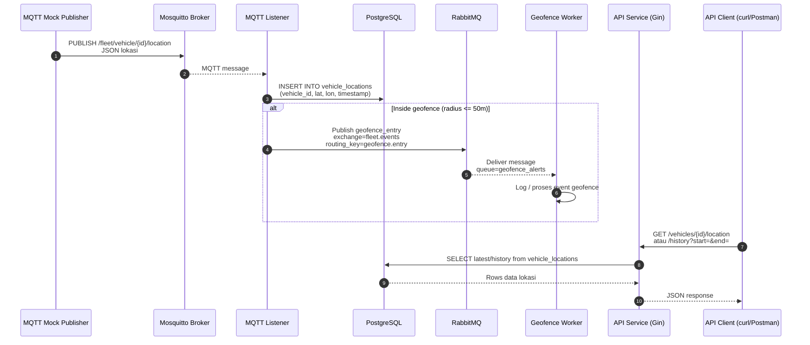

# Sistem Manajemen Armada (Backend)

Proyek ini adalah layanan backend sederhana untuk sistem manajemen armada yang menampilkan integrasi:

- MQTT (Mosquitto) sebagai penerima data lokasi kendaraan
- PostgreSQL sebagai penyimpanan lokasi
- RabbitMQ sebagai event bus untuk geofence
- Layanan Golang:
    - API Service (REST, Gin)
    - MQTT Listener (subscribe lokasi → simpan DB → kirim event geofence)
    - Geofence Worker (consume event geofence)
    - MQTT Mock Publisher (kirim data lokasi dummy setiap 2 detik)
- Docker Compose untuk menjalankan seluruh komponen

---

## Arsitektur Singkat

Alur data utama:

1. **MQTT Mock Publisher**
    - Mengirim pesan JSON setiap 2 detik ke topik:
      ```
      /fleet/vehicle/{vehicle_id}/location
      ```
    - Contoh payload:
      ```json
      {
        "vehicle_id": "B1234XYZ",
        "latitude": -6.2088,
        "longitude": 106.8456,
        "timestamp": 1715003456
      }
      ```

2. **MQTT Listener**
    - Subscribe ke `/fleet/vehicle/+/location`
    - Parse JSON → simpan ke tabel `vehicle_locations` di PostgreSQL
    - Cek apakah posisi masuk radius geofence (default 50m)
    - Jika masuk radius:
        - Publish event ke **RabbitMQ**:
            - Exchange: `fleet.events`
            - Routing key: `geofence.entry`
            - Queue: `geofence_alerts`

3. **API Service**
    - Endpoint:
        - `GET /vehicles/{vehicle_id}/location`
          → ambil lokasi **terakhir** dari DB
        - `GET /vehicles/{vehicle_id}/history?start=...&end=...`
          → ambil **riwayat** dalam rentang waktu tertentu (epoch second)

4. **Geofence Worker**
    - Consume queue `geofence_alerts`
    - Saat menerima event, worker akan log / memproses event (bisa dikembangkan ke notifikasi, dsb)

### Diagram Sequence (Mermaid)


## Prasyarat

- Docker & Docker Compose
- (Opsional) Go 1.22+ jika ingin menjalankan service langsung tanpa Docker
- Postman / curl untuk uji API

## Cara Menjalankan
Dari root project:
```bash
docker compose up --build
```

## Cek data mock masuk ke PostgreSQL
1. Masuk ke container database:
```bash
docker exec -it fleet-db psql -U mastama -d fleetdb
```
2. Di dalam PSQL
```bash
SELECT * FROM vehicle_locations
WHERE vehicle_id = 'B1234XYZ'
ORDER BY timestamp DESC
LIMIT 5;
```
Untuk check range timestamp di DB (digunakan pada pengecekan Riwayat Lokasi)
```bash
SELECT MIN(timestamp), MAX(timestamp)
FROM vehicle_locations
WHERE vehicle_id = 'B1234XYZ';
```

## Test menggunakan postman
1. API – Lokasi Terakhir Kendaraan
```bash
curl "http://localhost:8080/vehicles/B1234XYZ/location"
```
Contoh response:
{
"id": 158,
"vehicle_id": "B1234XYZ",
"latitude": -6.20920177632814,
"longitude": 106.846075466441,
"timestamp": 1764315502
}
2. API – Riwayat Lokasi dengan Rentang Waktu
```bash
curl --location 'http://localhost:8080/vehicles/B1234XYZ/history?start=1764314588&end=1764315424'
```
Contoh response:
[
{
"id": 1,
"vehicle_id": "B1234XYZ",
"latitude": -6.208484485470945,
"longitude": 106.84597915606092,
"timestamp": 1764314588
},
{
"id": 2,
"vehicle_id": "B1234XYZ",
"latitude": -6.209044276412346,
"longitude": 106.84598792999094,
"timestamp": 1764314590
},
{
"id": 3,
"vehicle_id": "B1234XYZ",
"latitude": -6.209292687024267,
"longitude": 106.84523734562335,
"timestamp": 1764314592
}
]

## Tentang Pengembang

Proyek ini dikembangkan oleh **Singgih Pratama**  
Backend Engineer

- GitHub: https://github.com/mastama
- LinkedIn: https://www.linkedin.com/in/singgih-pratama/


